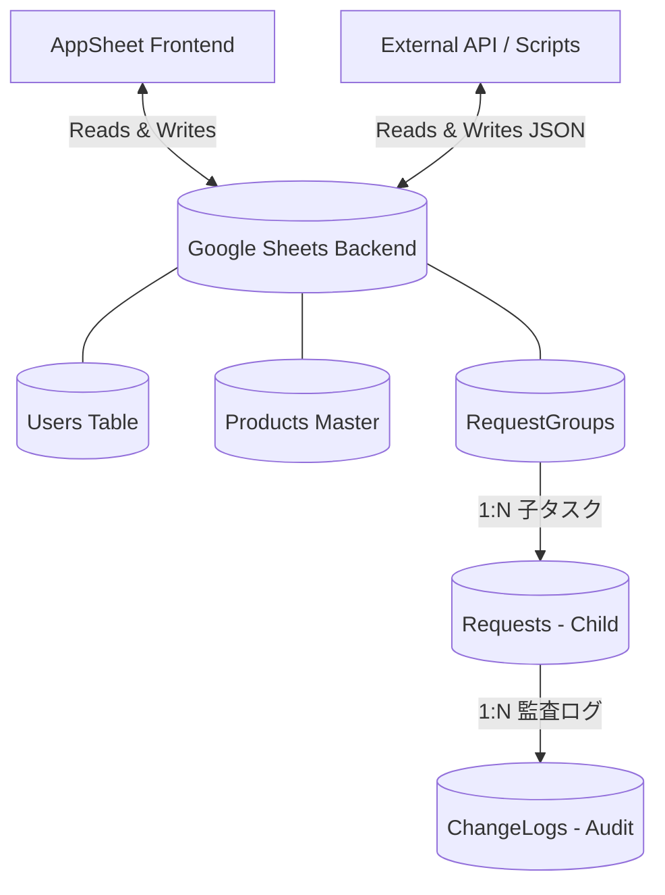
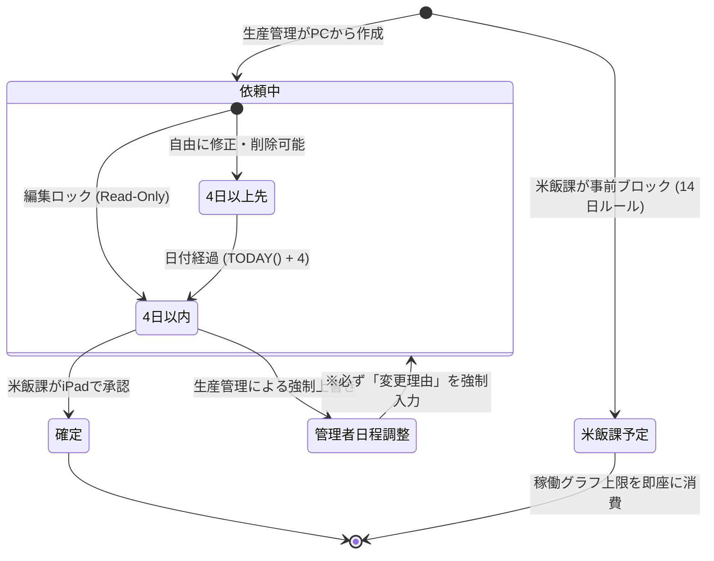
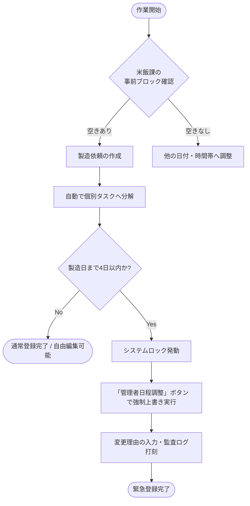
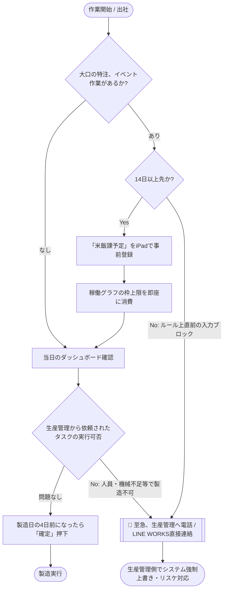

# 🏗 システム仕様・アーキテクチャ設計

本ドキュメントは、「米飯課への製造依頼システム」のデータベース設計、AppSheet特有の制約ロジック、およびステートマシン（状態遷移）を解説します。

## 1. データベースアーキテクチャ (ER図)
Google Spreadsheetsを完全なバックエンドデータベースとして利用しています。
*(注意: 現場では共有iPadを利用するため、`USEREMAIL()`ではなく独自の`UserId`キーを用いて認証・記録を行っています)。*

## 2. 状態遷移と4日ルール (State Machine)
依頼データ（Requests）は、製造日までの残日数（4日ルール）によって厳密に操作権限が変化します。

## 3. 統合稼働グラフと枠制限設定
各時間帯（早朝・昼間）には「製造可能な上限時間（枠）」のパラメータが存在し、これを元に容量をコントロールしています。
*   **グラフの制限:** 統合稼働グラフは最大180分（例）までのゲージで表示されます。
*   **先取りブロック優先:** 米飯課が「予定ブロック」を入力すると、その分が事前に稼働グラフの下地として積み上げられ、生産管理側は残りの空き時間（キャパシティ）にのみジョブを割り当てられます。
*   **AppSheet APIを活用したデータ連携:** 上記のような予定データや利用枠データの抽出・外部挿入は、AppSheet APIを通じて外部システムと直接連携可能です（`tests_and_data/`参照）。

## 4. 部署別ワークフロー (Departmental Workflows)

### 👨‍💼 生産管理部門 (Production Management) のフロー
生産管理部門は主に**PC（ブラウザ）**を利用し、製造計画を立案・入力します。（※生産管理側はいつでも自由に依頼を追加可能です）

### 👨‍🍳 米飯課 (Rice Department) のフロー
米飯課は主に製造現場の**共有iPad**を利用し、当日のスケジュール確認と「米飯課主導の事前予定」の枠取りを行います。
※現場の清掃や特別な作業予定は、生産管理が依頼を入れる前に枠を確保するため、必ず**14日以上前**に「米飯課予定登録」を行う必要があります。

