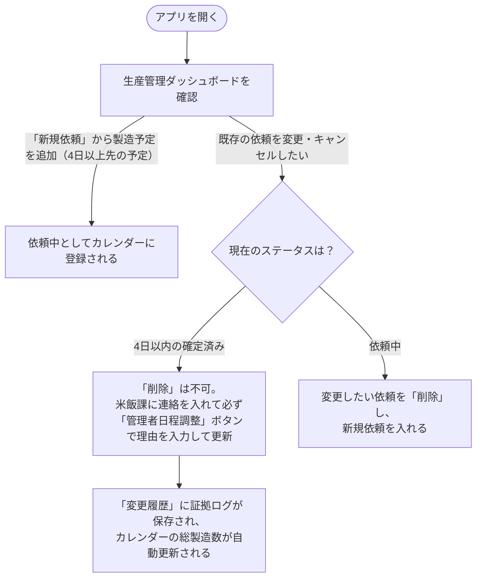
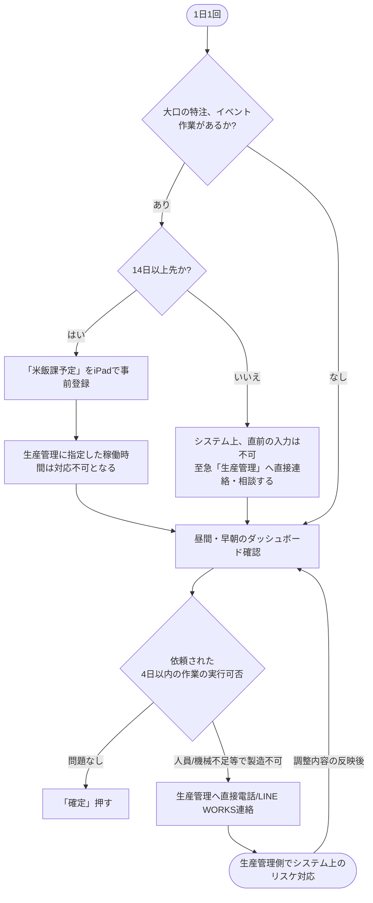

# 🏭 製造依頼システム 利用マニュアル

このページは、iPadおよびPCで利用する「製造依頼システム」の公式マニュアルです。担当部署ごとに操作方法が異なりますので、該当する項目を確認してください。

---

## 👨‍🍳 【米飯課向け】利用マニュアル

米飯課（現場担当者）は、二週間以上先の予定の登録と、生産管理から依頼されたスケジュールの確認と、作業の「確定（ロック）」を行います。

### 1. スケジュールの確認
*   **使用画面:** アプリを開くと、自動的に `早朝ダッシュボード` または `昼間ダッシュボード` が表示されます。
*   カレンダーやグラフを見て、将来の製造予定（準備）を確認してください。
    *   **💡 フィルター活用:** 画面右上の「ろうと（漏斗）」マークを使うと、特定の時間帯（早朝や昼間）、または特定の品目だけを絞り込むことができます。例えば、`品目名（表示名）` に「おでん」と入力して検索すると、おでんに関する早朝・昼間のタスクだけが画面に並ぶため、当日の流れが非常に視覚的に分かりやすくなります。

### 2. 「確定（ロック）」ルールについて（重要）
誤操作を防ぐため、**「製造日の4日前」** になるまでは依頼を確定することはできません。
*   **4日以上先:** スケジュールは表示されますが、「確定」ボタンはありません。あくまで「予定」として確認してください。
*   **4日以内:** 画面に **`確定`** ボタンが緑色で出現します。人員・材料に問題がなければボタンを押し、スケジュールをロックしてください。

### 3. 日程調整やキャンセルが必要な場合
現場のアプリ画面からは、依頼の「削除」や「差し戻し」はできません。
もし「人員不足」「機械トラブル」等でスケジュール通りに製造できない場合は、**すぐに生産管理（管理部）へ電話またはLINE WORKSで連絡してください。** 生産管理側でシステムの日程変更・取り消し（ロット数0）処理を行います。

### 4. 自身の予定登録（事前スケジュールブロック）
米飯課独自の稼働予定（イベントや大口の特注等）をカレンダーに事前に登録し、枠をブロックすることができます。
*   **稼働グラフの蓄積ルール:**
    *   システム上、各時間帯には製造可能な「上限時間（枠）」が設定されています。（※現在の設定例: 昼間は180分、早朝はX分等。この上限は時期によって変動します）。
    *   米飯課がこの画面で予定する作業時間（分）を入力すると、ダッシュボード上の **`統合稼働グラフ`** にその時間が積み上がります（ゲージが埋まります）。なお、このグラフは原則として「3週間先」までを表示します。
    *   （※グラフはヒストグラム形式のため、双方いずれの予定も入っていない日はグラフ自体に表示されませんが、カレンダーを見れば空白だと分かります）。
    *   **【例】:** 昼間の枠が合計180分の日に、米飯課が「準備・メンテ：60分」として事前登録した場合、グラフはすでに60分埋まった状態となり、生産管理が後から追加できる依頼は上限までの「残り120分」分となります。
*   **追加画面:** `米飯課予定登録` の画面から行います。
*   **14日前ルール:** このブロック登録は原則として**「製造日の14日（2週間）前」**までに行ってください（※システムで制限されており、14日以内の直近予定は選択できません）。
*   **スケジュールの反映:** 登録後はカレンダー・グラフ上で即座に共有されます。これにより、生産管理側からも「残り時間がいくらか」が明確になり、無理な依頼を防ぐことができます。

---

## 🏢 【生産管理向け】利用マニュアル

生産管理（管理者）は、製造依頼の作成、スケジュールの強制調整、および全変更履歴の監査を行います。

### 1. 新規製造依頼の作成
1.  **使用画面:** `生産管理ダッシュボード` を開きます。
2.  画面右上の **`新規依頼`** ボタン（または `+ 追加`）を押します。
3.  親グループ（日付等）を作成後、下部の **`作業日程追加`** から具体的な品目と「ロット数」を入力します。
    *   **ロット数の端数（小数点）入力ルール:** ロット数は小数点第3位まで細かく入力可能です。入力した数値は、品目マスタの「1ロットあたりの規定数」に掛け算され、総製造数が自動算出されます。
    *   **【計算例1】:** マスタの規定ロットサイズが `300` の品目に対し、ロット数を **`0.666`** と入力すると、製造総数は **`200`** となります（300 × 0.666 ≒ 200）。
    *   **【計算例2】:** マスタの規定ロットサイズが `150` の品目に対し、ロット数を **`1.5`** と入力すると、製造総数は **`225`** となります（150 × 1.5 = 225）。
4.  保存すると、ステータスが `依頼中`（ドラフト）として米飯課のカレンダーに反映されます。

**💡 【Tips】効率的な計画のための「フィルター機能（漏斗マーク）」**
画面右上にある「ろうと（漏斗）」マークのフィルター設定を使うと、表示状態を柔軟に絞り込むことができ、計画全体の整合性を確認するのに非常に便利です。
*   **時間帯や品目での絞り込み:** カレンダーを「早朝」だけ、「昼間」だけ、または特定の対象品目だけに限定して表示できます。
*   **【活用例】関連タスクの同日チェック:** 特定のスケジュール（例：「おでん」の早朝タスクと昼間タスクを必ず同日に配置しなければならない場合）を組む際は、フィルターの **`品目名（表示名）`** に **「おでん」** と入力して検索してください。カレンダー上が「おでん」に関連するジョブのみになるため、日付のズレや予定漏れがないかを一目で完全に確認できます。

### 2. 依頼の修正・キャンセル（4日ルール）
製造日までの「日数」によって、操作方法が厳密に変化します。

#### パターンA: 4日以上先の場合（通常キャンセル・再登録）
まだ米飯課の準備期間に入っていないため、自由に依頼の取り消し（削除）が可能です。
*   **【重要】直接の編集はできません。** 誤操作やシステムエラーを防ぐため、日付や数量などの内容を変更したい場合は、対象の依頼を一度完全に **`削除 (Delete)`** してから、改めて正しい内容で **新規依頼を作成（再登録）** してください。

#### パターンB: 4日以内、または「確定済」の場合（管理者強制上書き）
すでに現場が準備に入っている、あるいはロックされているため、システム上で証拠ログを残す必要があります。通常の修正・削除ボタンは消滅します。
1.  対象の依頼を開き、**`管理者日程調整`** ボタンを押します。
2.  変更後の日付やロット数を入力し、**必ず「変更理由」をテキストで入力**してください（例：「現場機械トラブルにより明日に延期」）。
3.  **完全キャンセルの場合:** 削除はできないため、新ロット数を **`0`** にして保存してください。
4.  保存すると、総製造数のグラフが自動更新され、**`変更履歴 (ChangeLogs)`** に「誰が・いつ・なぜ変更したか」が完全永久保存されます。

### 3. ユーザー権限の管理（Admin限定）
新入社員の追加や部署異動があった場合は、アプリ左上のハンバーガーメニューから **`ユーザー管理`** を開きます。
*   `+ Add` からメールアドレスを入力し、Role（例: `米飯課`）を指定して保存してください。これにより、対象者に自動で正しいダッシュボードが表示されるようになります。

### 4. 依頼マスタの管理
新しい製造品目が増えた場合や、1ロットあたりの製造数量にルール変更があった場合は、マスタデータを更新します。
1. アプリ左上のハンバーガーメニューから **`依頼マスタ`** を開きます（生産管理およびAdminにのみ表示されます）。
2. **新規追加:** 画面右下の `+ 追加` ボタンを押し、品目名、ロットサイズ、単位（kg、個、切など）を入力して保存します。
3. **既存の修正:** 既存の品目名をタップして詳細を開き、えんぴつアイコン（編集）から数値を変更して保存します。
*※ここでロットサイズ等を変更すると、以後に作成される新規製造依頼の「総製造数（ロット数 × ロットサイズ）」の自動計算に直ちに反映されます。*

### 5. 製造枠（上限時間）と米飯課のブロックについて
米飯課・生産管理の双方で共通する重要なルールとして、各時間帯には「製造可能な上限時間（枠）」が存在します（※現在の設定例: 昼間＝180分、早朝＝X分。※この上限パラメータは時期により変動する可能性があります）。
*   **稼働グラフの蓄積:** 生産管理が新規依頼を追加すると、その目安時間分だけダッシュボードの **`統合稼働グラフ`** が積み上がっていきます（上限に向けてゲージが埋まります）。
*   **米飯課の事前ブロック:** 米飯課側が事前に「予定ブロック」を入れた場合も、それに合算する形でグラフが埋まります（例：昼間の上限が180分の日に、米飯課が事前に60分の予定を入れると、グラフはすでに60分埋まった状態からスタートし、生産管理がさらに追加できるのは残り120分までとなります）。
*   **グラフ表示の注意:** 統合稼働グラフは原則として「3週間先まで」の状況を表示します。また、ヒストグラム形式の仕様により「双方の予定が全く入っていない日」はグラフ上からスキップ（非表示）されますが、カレンダーで確認できるため心配は不要です。
*   依頼を作成する際は、その日の稼働グラフが上限を超過してエラーとならないように注意してスケジュールを組んでください。

---

## 📊 操作フロー図

### 👨‍💼 生産管理部門のフロー

### 👨‍🍳 米飯課のフロー

