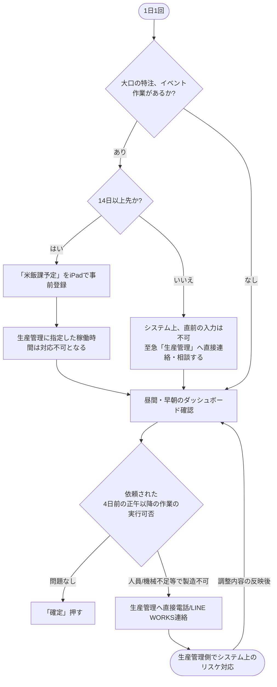
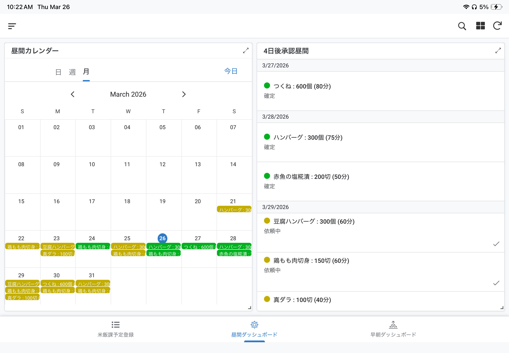
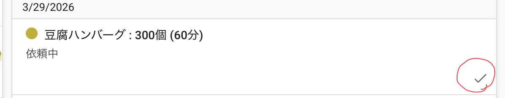
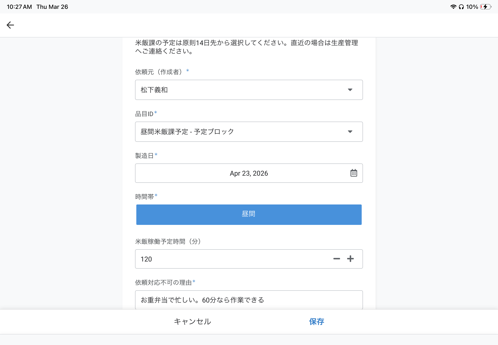
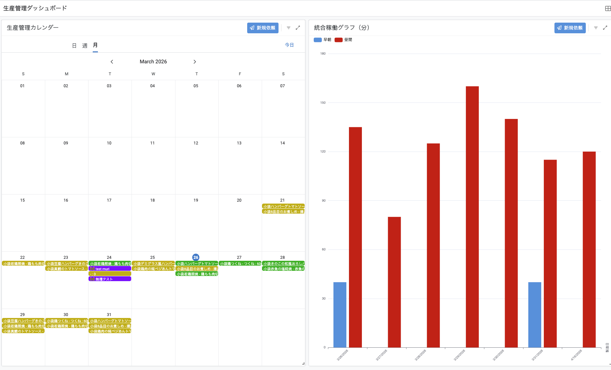

# 👨‍🍳 米飯課 利用マニュアル

米飯課（現場担当者）は、二週間以上先の予定の登録と、生産管理から依頼されたスケジュールの確認と、作業の「確定（ロック）」を行います。

| 画面名 | 説明 |
| :--- | :--- |
| 📋 米飯課予定登録 | 大口の特注やイベント等の稼働予定を事前に登録し、枠をブロックする画面 |
| ⚙️ 昼間ダッシュボード | 昼間帯の製造スケジュール確認と「確定」操作を行うメイン画面 |
| 🌅 早朝ダッシュボード | 早朝帯の製造スケジュール確認と「確定」操作を行うメイン画面 |

## 📊 操作フロー図

---

---

## 1. スケジュールの確認
*   **使用画面:** アプリを開くと、自動的に `早朝ダッシュボード` または `昼間ダッシュボード` が表示されます。
*   カレンダーやグラフを見て、将来の製造予定（準備）を確認してください。

## 2. 「確定（ロック）」ルールについて（重要）
誤操作を防ぐため、**「製造日の4日前の正午（12:00）」** になるまでは依頼を確定することはできません。
*   **4日前の正午前まで:** スケジュールは表示されますが、「確定」ボタンはありません。あくまで「予定」として確認してください。
*   **4日前の正午以降:** 画面に **`チェック（確定）`** ボタンが緑色で出現します。人員・材料に問題がなければボタンを押し、スケジュールをロックしてください。

## 3. 日程調整やキャンセルが必要な場合
現場のアプリ画面からは、依頼の「削除」や「差し戻し」はできません。
もし「人員不足」「機械トラブル」等でスケジュール通りに製造できない場合は、**すぐに生産管理（管理部）へ電話またはLINE WORKSで連絡してください。** 生産管理側でシステムの日程変更・取り消し（ロット数0）処理を行います。

## 4. 自身の予定登録（事前スケジュールブロック）
米飯課独自の稼働予定（イベントや大口の特注等）をカレンダーに事前に登録し、枠をブロックすることができます。
*   **追加画面:** `米飯課予定登録` の画面から行います。
*   **14日前ルール:** このブロック登録は原則として**「製造日の14日（2週間）前」**までに行ってください（※システムで制限されており、14日以内の直近予定は選択できません）。
*   **スケジュールの反映:** 登録後はカレンダー・グラフ上で即座に共有されます。これにより、生産管理側からも「残り時間がいくらか」が明確になり、無理な依頼を防ぐことができます。

*   **稼働グラフの蓄積ルール:**
    *   システム上、各時間帯には製造可能な「上限時間（枠）」が設定されています。（※現在の設定例: 昼間は180分、早朝はX分等。この上限は時期によって変動します）。
    *   米飯課がこの画面で予定する作業時間（分）を入力すると、ダッシュボード上の **`統合稼働グラフ`** にその時間が積み上がります（ゲージが埋まります）。なお、このグラフは原則として「3週間先」までを表示します。
    *   （※グラフはヒストグラム形式のため、双方いずれの予定も入っていない日はグラフ自体に表示されませんが、カレンダーを見れば空白だと分かります）。
    *   **【例】:** 昼間の枠が合計180分の日に、米飯課が「準備・メンテ：60分」として事前登録した場合、グラフはすでに60分埋まった状態となり、生産管理が後から追加できる依頼は上限までの「残り120分」分となります。下の様に生産管理の方で見えます。

